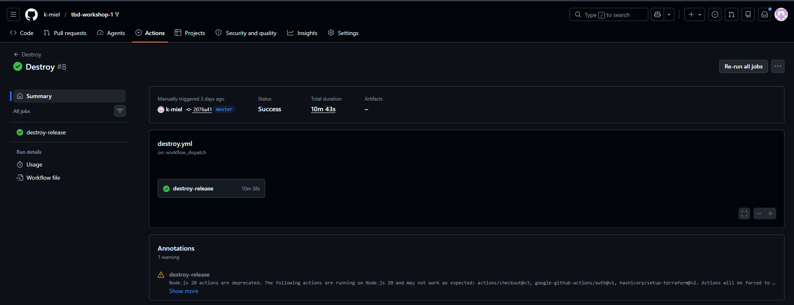
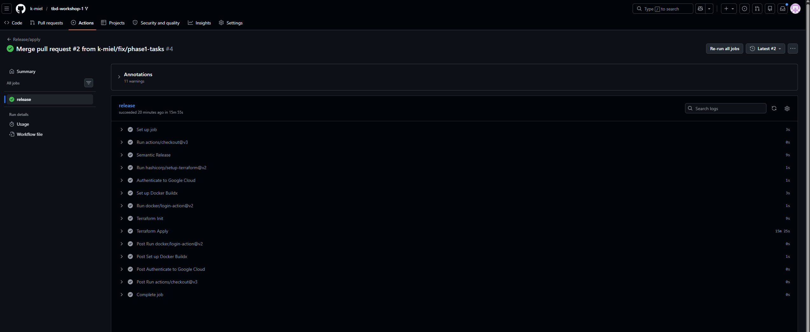
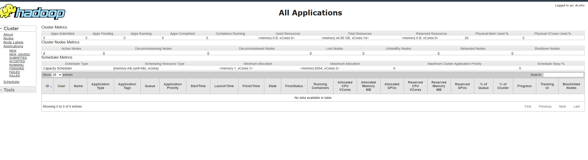
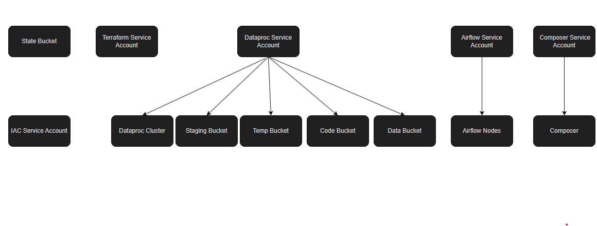
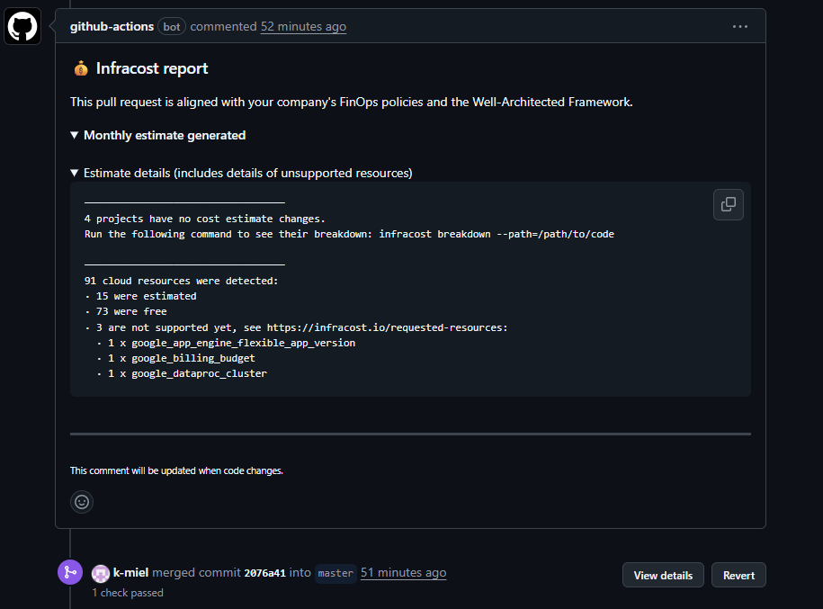
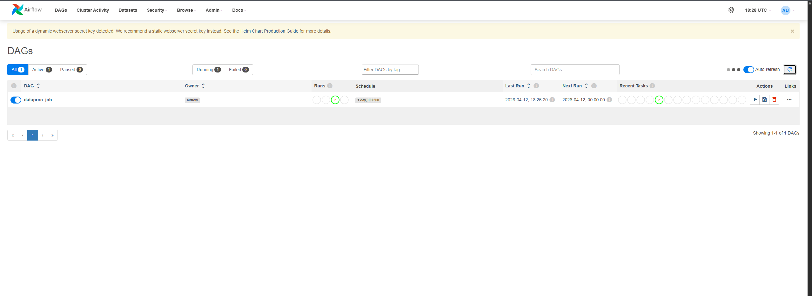
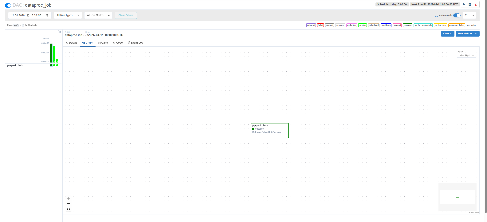
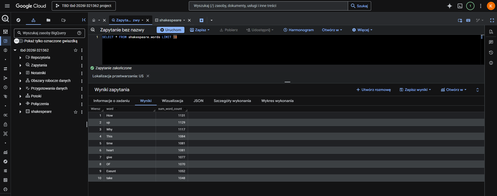
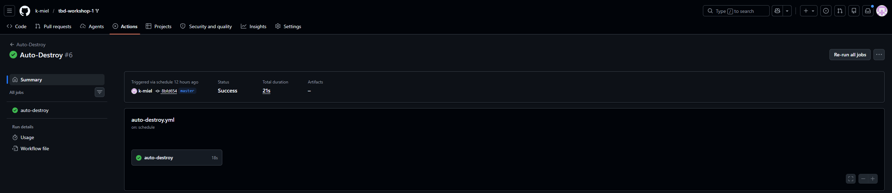

IMPORTANT ❗ ❗ ❗ Please remember to destroy all the resources after each work session. You can recreate infrastructure by creating new PR and merging it to master.


                                                                                                                                                                                                                                                                                                                                                                                  
## Phase 1 Exercise Overview

  ```mermaid
  flowchart TD
      A[🔧 Step 0: Fork repository] --> B[🔧 Step 1: Environment variables\nexport TF_VAR_*]
      B --> C[🔧 Step 2: Bootstrap\nterraform init/apply\n→ GCP project + state bucket]
      C --> D[🔧 Step 3: Quota increase\nCPUS_ALL_REGIONS ≥ 24]
      D --> E[🔧 Step 4: CI/CD Bootstrap\nWorkload Identity Federation\n→ keyless auth GH→GCP]
      E --> F[🔧 Step 5: GitHub Secrets\nGCP_WORKLOAD_IDENTITY_*\nINFRACOST_API_KEY]
      F --> G[🔧 Step 6: pre-commit install]
      G --> H[🔧 Step 7: Push + PR + Merge\n→ release workflow\n→ terraform apply]

      H --> I{Infrastructure\nrunning on GCP}

      I --> J[📋 Task 3: Destroy\nGitHub Actions → workflow_dispatch]
      I --> K[📋 Task 4: New branch\nModify tasks-phase1.md\nPR → merge → new release]
      I --> L[📋 Task 5: Analyze Terraform\nterraform plan/graph\nDescribe selected module]
      I --> M[📋 Task 6: YARN UI\ngcloud compute ssh\nIAP tunnel → port 8088]
      I --> N[📋 Task 7: Architecture diagram\nService accounts + buckets]
      I --> O[📋 Task 8: Infracost\nUsage profiles for\nartifact_registry + storage_bucket]
      I --> P[📋 Task 9: Spark job fix\nAirflow UI → DAG → debug\nFix spark-job.py]
      I --> Q[📋 Task 10: BigQuery\nDataset + external table\non ORC files]
      I --> R[📋 Task 11: Spot instances\npreemptible_worker_config\nin Dataproc module]
      I --> S[📋 Task 12: Auto-destroy\nNew GH Actions workflow\nschedule + cleanup tag]

      style A fill:#4a9eff,color:#fff
      style B fill:#4a9eff,color:#fff
      style C fill:#4a9eff,color:#fff
      style D fill:#ff9f43,color:#fff
      style E fill:#4a9eff,color:#fff
      style F fill:#ff9f43,color:#fff
      style G fill:#4a9eff,color:#fff
      style H fill:#4a9eff,color:#fff
      style I fill:#2ed573,color:#fff
      style J fill:#a55eea,color:#fff
      style K fill:#a55eea,color:#fff
      style L fill:#a55eea,color:#fff
      style M fill:#a55eea,color:#fff
      style N fill:#a55eea,color:#fff
      style O fill:#a55eea,color:#fff
      style P fill:#a55eea,color:#fff
      style Q fill:#a55eea,color:#fff
      style R fill:#a55eea,color:#fff
      style S fill:#a55eea,color:#fff
```

  Legend

  - 🔵 Blue — setup steps (one-time configuration)
  - 🟠 Orange — manual steps (GCP Console / GitHub UI)
  - 🟢 Green — infrastructure ready
  - 🟣 Purple — tasks to complete and document in tasks-phase1.md

1. Authors:

   **Group 2**

   **https://github.com/k-miel/tbd-workshop-1**

2. Follow all steps in README.md.

3. From available Github Actions select and run destroy on master branch.

   

4. Create new git branch and:
    1. Modify tasks-phase1.md file.

    2. Create PR from this branch to **YOUR** master and merge it to make new release.

    


5. Analyze terraform code. Play with terraform plan, terraform graph to investigate different modules.

    ### Wybrany moduł: `modules/dataproc/` ([main.tf](modules/dataproc/main.tf))

    Moduł `dataproc` tworzy kompletną infrastrukturę klastra Hadoop/Spark w GCP. Składa się z następujących zasobów:

    | Zasób Terraform | Opis |
    |---|---|
    | `google_project_service.dataproc` | Włącza API `dataproc.googleapis.com` w projekcie GCP |
    | `google_service_account.dataproc_sa` | Tworzy dedykowany Service Account `{project_name}-dataproc-sa` |
    | `google_project_iam_member.dataproc_worker` | Nadaje SA rolę `roles/dataproc.worker` |
    | `google_project_iam_member.dataproc_bigquery_data_editor` | Nadaje SA rolę `roles/bigquery.dataEditor` (zapis danych) |
    | `google_project_iam_member.dataproc_bigquery_user` | Nadaje SA rolę `roles/bigquery.user` (uruchamianie zapytań) |
    | `google_storage_bucket.dataproc_staging` | Bucket GCS dla plików stagingowych zadań Spark |
    | `google_storage_bucket.dataproc_temp` | Bucket GCS dla plików tymczasowych zadań Spark |
    | `google_storage_bucket_iam_member` (×2) | Przyznaje SA uprawnienia `roles/storage.objectAdmin` do obu bucketów |
    | `google_dataproc_cluster.tbd-dataproc-cluster` | Główny klaster Dataproc (master + 2 worker + 2 preemptible) |

    **Konfiguracja klastra `tbd-cluster`:**
    - Region: `europe-west1`, sieć: prywatna subnet `subnet-01` (10.10.10.0/24)
    - `internal_ip_only = true` — klaster nie ma zewnętrznych IP, dostęp tylko przez IAP
    - Komponenty opcjonalne: `JUPYTER`
    - HTTP port access włączony (`enable_http_port_access = true`)
    - Initialization action: instalacja przez pip: `pandas<2`, `mlflow`, `google-cloud-storage`, `jupyterlab`, `dbt-core`, `dbt-spark`
    - Master: 1 × `e2-standard-2`, 100 GB pd-standard
    - Workers: 2 × `e2-standard-2` + 2 preemptible, 100 GB pd-standard

    **Zależności zasobów** (kolejność tworzenia wymuszona przez `depends_on` w klastrze):
    - API i SA tworzone jako pierwsze (niezależnie od siebie)
    - IAM roles i GCS Buckets tworzone równolegle (obydwa zależą od SA)
    - Bucket IAM zależy od SA i GCS Buckets
    - Cluster tworzony jako ostatni (depends_on: API, SA, IAM roles, Bucket IAM)

    **Output `terraform graph -type=plan -target=module.dataproc`:**

    ```
    digraph {
    	compound = "true"
    	newrank = "true"
    	subgraph "root" {
    		"[root] module.dataproc.google_dataproc_cluster.tbd-dataproc-cluster (expand)" [label = "module.dataproc.google_dataproc_cluster.tbd-dataproc-cluster", shape = "box"]
    		"[root] module.dataproc.google_project_iam_member.dataproc_bigquery_data_editor (expand)" [label = "module.dataproc.google_project_iam_member.dataproc_bigquery_data_editor", shape = "box"]
    		"[root] module.dataproc.google_project_iam_member.dataproc_bigquery_user (expand)" [label = "module.dataproc.google_project_iam_member.dataproc_bigquery_user", shape = "box"]
    		"[root] module.dataproc.google_project_iam_member.dataproc_worker (expand)" [label = "module.dataproc.google_project_iam_member.dataproc_worker", shape = "box"]
    		"[root] module.dataproc.google_project_service.dataproc (expand)" [label = "module.dataproc.google_project_service.dataproc", shape = "box"]
    		"[root] module.dataproc.google_service_account.dataproc_sa (expand)" [label = "module.dataproc.google_service_account.dataproc_sa", shape = "box"]
    		"[root] module.dataproc.google_storage_bucket.dataproc_staging (expand)" [label = "module.dataproc.google_storage_bucket.dataproc_staging", shape = "box"]
    		"[root] module.dataproc.google_storage_bucket.dataproc_temp (expand)" [label = "module.dataproc.google_storage_bucket.dataproc_temp", shape = "box"]
    		"[root] module.dataproc.google_storage_bucket_iam_member.staging_bucket_iam (expand)" [label = "module.dataproc.google_storage_bucket_iam_member.staging_bucket_iam", shape = "box"]
    		"[root] module.dataproc.google_storage_bucket_iam_member.temp_bucket_iam (expand)" [label = "module.dataproc.google_storage_bucket_iam_member.temp_bucket_iam", shape = "box"]
    		"[root] module.dataproc.google_dataproc_cluster.tbd-dataproc-cluster (expand)" -> "[root] module.dataproc.google_project_iam_member.dataproc_bigquery_data_editor (expand)"
    		"[root] module.dataproc.google_dataproc_cluster.tbd-dataproc-cluster (expand)" -> "[root] module.dataproc.google_project_iam_member.dataproc_bigquery_user (expand)"
    		"[root] module.dataproc.google_dataproc_cluster.tbd-dataproc-cluster (expand)" -> "[root] module.dataproc.google_project_iam_member.dataproc_worker (expand)"
    		"[root] module.dataproc.google_dataproc_cluster.tbd-dataproc-cluster (expand)" -> "[root] module.dataproc.google_project_service.dataproc (expand)"
    		"[root] module.dataproc.google_dataproc_cluster.tbd-dataproc-cluster (expand)" -> "[root] module.dataproc.google_storage_bucket_iam_member.staging_bucket_iam (expand)"
    		"[root] module.dataproc.google_dataproc_cluster.tbd-dataproc-cluster (expand)" -> "[root] module.dataproc.google_storage_bucket_iam_member.temp_bucket_iam (expand)"
    		"[root] module.dataproc.google_project_iam_member.dataproc_bigquery_data_editor (expand)" -> "[root] module.dataproc.google_service_account.dataproc_sa (expand)"
    		"[root] module.dataproc.google_project_iam_member.dataproc_bigquery_user (expand)" -> "[root] module.dataproc.google_service_account.dataproc_sa (expand)"
    		"[root] module.dataproc.google_project_iam_member.dataproc_worker (expand)" -> "[root] module.dataproc.google_service_account.dataproc_sa (expand)"
    		"[root] module.dataproc.google_storage_bucket_iam_member.staging_bucket_iam (expand)" -> "[root] module.dataproc.google_service_account.dataproc_sa (expand)"
    		"[root] module.dataproc.google_storage_bucket_iam_member.staging_bucket_iam (expand)" -> "[root] module.dataproc.google_storage_bucket.dataproc_staging (expand)"
    		"[root] module.dataproc.google_storage_bucket_iam_member.temp_bucket_iam (expand)" -> "[root] module.dataproc.google_service_account.dataproc_sa (expand)"
    		"[root] module.dataproc.google_storage_bucket_iam_member.temp_bucket_iam (expand)" -> "[root] module.dataproc.google_storage_bucket.dataproc_temp (expand)"
    	}
    }
    ```

6. Reach YARN UI

   **Komenda tunelu IAP:**

   ```bash
   gcloud compute ssh tbd-cluster-m \
     --project=tbd-2026l-321362 \
     --zone=europe-west1-b \
     --tunnel-through-iap \
     -- -L 8088:localhost:8088 -N
   ```

   **Port:** 8088 (YARN ResourceManager UI)

   **Opis:** Klaster Dataproc ma `internal_ip_only = true`, więc nie posiada zewnętrznego IP. Połączenie SSH przez `--tunnel-through-iap` kieruje ruch przez Google Identity-Aware Proxy (firewall `fw-allow-ingress-iap` przepuszcza TCP:22 z zakresu `35.235.240.0/20`). Flaga `-L 8088:localhost:8088` tworzy lokalny port-forward — po uruchomieniu YARN UI jest dostępny pod adresem **http://localhost:8088**.

   

   Hint: the Dataproc cluster has `internal_ip_only = true`, so you need to use an IAP tunnel.
   See: `gcloud compute ssh` with `-- -L <local_port>:localhost:<remote_port>` and `--tunnel-through-iap` flag.
   YARN ResourceManager UI runs on port **8088**.

7. Draw an architecture diagram (e.g. in draw.io) that includes:
    1. Description of the components of service accounts
    2. List of buckets for disposal


    Diagram architektury:
    

8. Create a new PR and add costs by entering the expected consumption into Infracost
For all the resources of type: `google_artifact_registry_repository`, `google_storage_bucket`
create a sample usage profiles and add it to the Infracost task in CI/CD pipeline. Usage file [example](https://github.com/infracost/infracost/blob/master/infracost-usage-example.yml)

   ```yaml
   version: 0.1
   resource_usage:
     module.gcr.google_artifact_registry_repository.registry:
       storage_gb: 50
       monthly_data_transfer_gb: 10
     module.data-pipelines.google_storage_bucket.tbd-data-bucket:
       storage_gb: 500
       monthly_data_retrieval_gb: 100
       monthly_egress_data_transfer_gb: 100
     module.data-pipelines.google_storage_bucket.tbd-code-bucket:
       storage_gb: 10
       monthly_data_retrieval_gb: 5
       monthly_egress_data_transfer_gb: 5
     module.dataproc.google_storage_bucket.dataproc_staging:
       storage_gb: 50
       monthly_data_retrieval_gb: 20
       monthly_egress_data_transfer_gb: 10
     module.dataproc.google_storage_bucket.dataproc_temp:
       storage_gb: 50
       monthly_data_retrieval_gb: 20
       monthly_egress_data_transfer_gb: 10
   ```

      


9. Find and correct the error in spark-job.py

    After `terraform apply` completes, connect to the Airflow cluster:
    ```bash
    gcloud container clusters get-credentials airflow-cluster --zone europe-west1-b --project PROJECT_NAME
    ```
    
    Then check the external IP (AIRFLOW_EXTERNAL_IP) of the webserver service:
    kubectl get svc -n airflow airflow-webserver                                                                                                                                                                 
                                              
                                                                                                                                                                                                               
    ▎ Note: If EXTERNAL-IP shows <pending>, wait a moment and retry — LoadBalancer IP allocation may take 1-2 minutes.  

    DAG files are synced automatically from your GitHub repo via git-sync sidecar.
    Airflow variables and the `google_cloud_default` GCP connection are also configured by Terraform.

    a) In the Airflow UI (http://AIRFLOW_EXTERNAL_IP:8080, login: admin/admin), find the `dataproc_job` DAG, unpause it and trigger it manually.

    

    b) The DAG will fail. Examine the task logs in the Airflow UI to find the root cause.

    ```
    google.api_core.exceptions.NotFound: 404 GET https://storage.googleapis.com/storage/v1/b/tbd-2026l-9010-data?projection=noAcl&prettyPrint=false:
    The specified bucket does not exist.
    ```

    Błąd polegał na nieprawidłowym identyfikatorze projektu zakodowanym na stałe w skrypcie `spark-job.py` — ścieżka wyjściowa wskazywała na bucket `gs://tbd-2026l-9010-data/`, który nie istnieje. Prawidłowa nazwa bucketu to `gs://tbd-2026l-321362-data/`. Błąd znaleziono w logach taska `submit_dataproc_job` w Airflow UI (zakładka *Log* → sekcja *Exception*).

    c) Fix the error in `modules/data-pipeline/resources/spark-job.py` and re-upload the file to GCS:
    ```bash
    gsutil cp modules/data-pipeline/resources/spark-job.py gs://PROJECT_NAME-code/spark-job.py
    ```
    Then trigger the DAG again from the Airflow UI.

    [modules/data-pipeline/resources/spark-job.py](modules/data-pipeline/resources/spark-job.py)

    d) Verify the DAG completes successfully and check that ORC files were written to the data bucket:
    ```bash
    gs://tbd-2026l-321362-data/data/shakespeare/
    gs://tbd-2026l-321362-data/data/shakespeare/_SUCCESS
    gs://tbd-2026l-321362-data/data/shakespeare/part-00000-4ec4b2b9-143b-4e12-b8bc-cadcc81f92f6-c000.snappy.orc
    gs://tbd-2026l-321362-data/data/shakespeare/part-00000-afad560a-fa79-4481-a7b7-4a61dc22ef4f-c000.snappy.orc
    gs://tbd-2026l-321362-data/data/shakespeare/part-00001-4ec4b2b9-143b-4e12-b8bc-cadcc81f92f6-c000.snappy.orc
    gs://tbd-2026l-321362-data/data/shakespeare/part-00001-afad560a-fa79-4481-a7b7-4a61dc22ef4f-c000.snappy.orc
    gs://tbd-2026l-321362-data/data/shakespeare/part-00002-4ec4b2b9-143b-4e12-b8bc-cadcc81f92f6-c000.snappy.orc
    gs://tbd-2026l-321362-data/data/shakespeare/part-00002-afad560a-fa79-4481-a7b7-4a61dc22ef4f-c000.snappy.orc
    gs://tbd-2026l-321362-data/data/shakespeare/part-00003-4ec4b2b9-143b-4e12-b8bc-cadcc81f92f6-c000.snappy.orc
    ```

    


11. Create a BigQuery dataset and an external table using SQL

    ```sql
    CREATE SCHEMA IF NOT EXISTS shakespeare;
    CREATE OR REPLACE EXTERNAL TABLE shakespeare.words
    OPTIONS (
      format = 'ORC',
      uris = ['gs://tbd-2026l-321362-data/data/shakespeare/*.orc']
    );
    ```

    

    ***why does ORC not require a table schema?***
    ORC (Optimized Row Columnar) jest formatem "self-describing". Oznacza to, że pliki ORC przechowują metadane dotyczące schematu (nazwy i typy kolumn) bezpośrednio wewnątrz swojej struktury (zwykle w stopce pliku - footer). Dzięki temu systemy takie jak BigQuery potrafią automatycznie wydobyć strukturę tabeli bez konieczności jej ręcznego definiowania w zapytaniu DDL.

12. Add support for preemptible/spot instances in a Dataproc cluster

    Link do zmodyfikowanego pliku: [modules/dataproc/main.tf](modules/dataproc/main.tf)

    Wstawiony kod Terraform (fragment `cluster_config` w zasobie `google_dataproc_cluster`):
    ```hcl
    preemptible_worker_config {
      num_instances = 2
    }
    ```

13. Triggered Terraform Destroy on Schedule or After PR Merge. Goal: make sure we never forget to clean up resources and burn money.

    ```yaml
    name: Auto-Destroy
    on:
      schedule:
        - cron: '0 20 * * *'
      pull_request:
        branches: [ master ]
        types: [ closed ]

    permissions: read-all

    jobs:
      auto-destroy:
        if: |
          github.event_name == 'schedule' ||
          (github.event.pull_request.merged == true && contains(github.event.pull_request.title, '[CLEANUP]'))
        runs-on: ubuntu-latest
        permissions:
          contents: read
          id-token: write

        steps:
          - uses: 'actions/checkout@v3'
          - uses: hashicorp/setup-terraform@v2
            with:
              terraform_version: 1.11.0
          - id: 'auth'
            name: 'Authenticate to Google Cloud'
            uses: 'google-github-actions/auth@v1'
            with:
              workload_identity_provider: ${{ secrets.GCP_WORKLOAD_IDENTITY_PROVIDER_NAME }}
              service_account: ${{ secrets.GCP_WORKLOAD_IDENTITY_SA_EMAIL }}
          - name: Terraform Init
            run: terraform init -backend-config=env/backend.tfvars
          - name: Terraform Destroy
            run: terraform destroy -auto-approve -var-file env/project.tfvars
    ```

    

    ***write one sentence why scheduling cleanup helps in this workshop***
    Automatyczne niszczenie zasobów zgodnie z harmonogramem zapobiega niepotrzebnemu zużywaniu środków na koncie GCP w przypadku zapomnienia o ręcznym wywołaniu komendy destroy po zakończeniu pracy.
